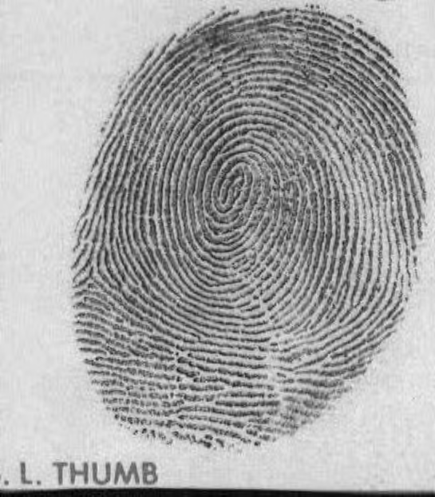
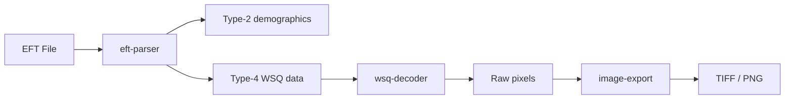

# nist-fingerprint

A Node.js library and CLI to parse, convert, and export fingerprint images from ANSI/NIST-ITL (EFT) files — with a pure-JavaScript WSQ decoder.

No native binaries. No platform headaches. Just `npm install` and go.

[](https://www.npmjs.com/package/nist-fingerprint)
[](LICENSE)
[](https://nodejs.org)
[](https://github.com/romainwurtz/nist-fingerprint/actions)
[](https://codecov.io/gh/romainwurtz/nist-fingerprint)

## Features

- **Pure-JavaScript WSQ decoder** — no native binaries, runs on macOS, Linux, and Windows
- **ANSI/NIST-ITL parser** — Type-1 (transaction), Type-2 (demographics), Type-4 (fingerprints)
- **CLI + library** — inspect from the terminal or `import` into your pipeline
- **WSQ-to-TIFF and WSQ-to-PNG conversion** — with correct PPI metadata
- **TypeScript declarations included**

## Quick Start

```bash
npx nist-fingerprint info samples/sample.eft      # inspect metadata
npx nist-fingerprint export samples/sample.eft    # export fingerprints as TIFF
```

## Install

```bash
# Global CLI
npm install -g nist-fingerprint

# As a library
npm install nist-fingerprint
```

## CLI Usage

| Command | Description |
|---------|-------------|
| `nist-fingerprint info <file>` | Display file metadata and fingerprint summary |
| `nist-fingerprint view <file>` | Preview fingerprint images in the terminal |
| `nist-fingerprint export <file>` | Export fingerprint images as TIFF or PNG |

Running `nist-fingerprint <file>` without a subcommand defaults to `info`.

### Options

| Option | Applies to | Default | Description |
|--------|-----------|---------|-------------|
| `-f, --finger <finger>` | `view`, `export` | all | Filter by position number (1-14) or name (e.g. `right_thumb`) |
| `-o, --output <dir>` | `export` | `./output` | Output directory (created if it doesn't exist) |
| `--format <format>` | `export` | `tiff` | Image format: `tiff` or `png` |

### Example: inspect a file

```
$ nist-fingerprint info samples/sample.eft

EFT Fingerprint File: sample.eft

  Name             Michael Scott
  Date of Birth    March 15, 1962
  Sex              Male
  Eye Color        Brown
  Hair Color       Brown
  Height           5'11"
  Weight           185 lbs
  Address          1725 SLOUGH AVE, SCRANTON, PA 18505
  Purpose          Criminal
  Scanner          TESTSCAN MODEL1
  Date Captured    February 23, 2026

  Fingerprints     1 images (1 rolled, 0 plain) — WSQ @ 500 PPI

  #  | Finger     | Size    | Type             | Compression
  6  | Left Thumb | 545x622 | Live-scan rolled | WSQ
```

### Example: export fingerprints

```
$ nist-fingerprint export samples/sample.eft --output samples --format png

  [1/1] Decoding Left Thumb... saved 06-left-thumb.png

  Done! 1 images exported to samples
```



The [`samples/`](samples/) directory contains a placeholder EFT file (`sample.eft`) and an exported fingerprint image.

## Library Usage

### Export all fingerprints as PNG

```js
import { parseEft, decodeWsq, toPng } from 'nist-fingerprint';
import { readFileSync, writeFileSync } from 'node:fs';

const buf = readFileSync('fingerprints.eft');
const eft = parseEft(buf);

for (const rec of eft.type4Records) {
  const { pixels, width, height } = decodeWsq(rec.imageData);
  const png = await toPng(pixels, width, height);
  writeFileSync(`finger-${rec.fingerPosition}.png`, png);
}
```

### Read subject info and list fingerprints

```js
import { parseEft } from 'nist-fingerprint';
import { readFileSync } from 'node:fs';

const buf = readFileSync('fingerprints.eft');
const eft = parseEft(buf);

// Demographic data from Type-2 record
console.log(`Subject: ${eft.type2.fullName}`);
console.log(`DOB: ${eft.type2.dob.year}-${eft.type2.dob.month}-${eft.type2.dob.day}`);

// Fingerprint summary from Type-4 records
for (const rec of eft.type4Records) {
  console.log(`  ${rec.fingerName}: ${rec.width}x${rec.height} px (${rec.compressionName})`);
}
```

These examples use top-level `await`, which requires Node >= 22 with ESM (`"type": "module"` in package.json).

## What is an EFT file?

EFT (Electronic Fingerprint Transmission) files follow the [ANSI/NIST-ITL 1-2011](https://www.nist.gov/programs-projects/ansinist-itl-standard) standard for exchanging biometric data between law enforcement agencies. A single file contains structured binary records:

- **Type-1** — Transaction info (file metadata, originating agency, character encoding)
- **Type-2** — Demographic data (subject name, date of birth, sex, eye/hair color, height, weight, address)
- **Type-4** — Fingerprint images (WSQ-compressed grayscale, typically at 500 PPI)

These files are the standard interchange format for fingerprint cards like the FBI's [FD-258](https://www.fbi.gov/file-repository/standard-fingerprint-form-fd-258-1.pdf), used for background checks, law enforcement submissions, and immigration processing.

## What is WSQ?

**WSQ (Wavelet Scalar Quantization)** is a lossy compression algorithm developed by the FBI specifically for grayscale fingerprint images. Unlike JPEG, which introduces blocking artifacts that degrade ridge detail, WSQ is optimized to preserve the fine ridge and valley structures that make fingerprints identifiable — typically at a capture resolution of 500 PPI.

The compression pipeline:

1. **CDF 9/7 wavelet transform** — 3 levels of decomposition producing 64 subbands (60 active; the last 4 are unused)
2. **Scalar quantization** — each subband quantized independently based on target bit rate
3. **Huffman coding** — entropy coding of the quantized coefficients

The WSQ format is specified in [IAFIS-IC-0110v3](https://www.nist.gov/itl/iad/image-group/wsq-bibliography).

## Architecture



## API

| Function | Signature | Returns |
|---|---|---|
| `parseEft` | `(buf: Buffer \| Uint8Array)` | `{ type1, type2, type4Records, fileSize }` |
| `decodeWsq` | `(data: Buffer \| Uint8Array)` | `{ width: number, height: number, pixels: Uint8Array }` |
| `toTiff` | `(pixels: Uint8Array, width, height, ppi?: number)` | `Promise<Buffer>` |
| `toPng` | `(pixels: Uint8Array, width, height)` | `Promise<Buffer>` |

`pixels` is always a `Uint8Array` of raw grayscale values (0-255), one byte per pixel, row-major order. `ppi` defaults to 500.

**Type-4 record properties:** Each object in `type4Records` contains `fingerPosition` (number 1-14), `fingerName` (e.g. "Right Thumb"), `width`, `height`, `ppi`, `imageData` (WSQ-compressed `Uint8Array`), `impressionName`, and `compressionName`.

**Also exported:** `exportFilename(position, format?)`, `FINGER_NAMES`, `FINGER_ALIASES`, `FINGER_SLUGS`, and lookup tables for `SEX_CODES`, `EYE_COLORS`, `HAIR_COLORS`, `COMPRESSION_TYPES`, `IMPRESSION_TYPES`.

## Requirements

- **Node >= 22** (uses ESM, top-level await, and modern Buffer APIs)
- **[sharp](https://sharp.pixelplumbing.com/)** is installed as a dependency for TIFF/PNG export. It ships prebuilt binaries for most platforms (macOS, Linux, Windows). If your environment lacks prebuilds, you may need build tools — see [sharp's installation guide](https://sharp.pixelplumbing.com/install).

## Getting Help

- [Open an issue](https://github.com/romainwurtz/nist-fingerprint/issues) for bugs or feature requests

## References

- [ANSI/NIST-ITL 1-2011](https://www.nist.gov/programs-projects/ansinist-itl-standard) — the standard governing EFT file structure
- [WSQ spec (IAFIS-IC-0110v3)](https://www.nist.gov/itl/iad/image-group/wsq-bibliography) — FBI/NIST WSQ compression specification and bibliography
- [JNBIS](https://github.com/mhshams/jnbis) — the Java implementation our WSQ decoder was ported from (Apache 2.0)
- [FD-258](https://www.fbi.gov/file-repository/standard-fingerprint-form-fd-258-1.pdf) — the standard FBI fingerprint card

## About

I received a fingerprint file for an FD-258 card and needed to inspect it on a Mac. There was no viewer, no command-line tool — the only options were Windows-only apps or abandoned native libraries that wouldn't compile. So I built one.

The WSQ decoder was the hard part: no usable JavaScript implementation existed, so I ported it byte-by-byte from [JNBIS](https://github.com/mhshams/jnbis), a Java library by Mohammad Shamsi. Getting the wavelet reconstruction right took a while, but now it runs anywhere Node runs — no native binaries, no platform headaches.

Made by [Romain Wurtz](https://github.com/romainwurtz).

[DigiCoders](https://www.digicoders.com) — a small but mighty team that turns creative designs into flawless digital products. Clean code, pixel-perfect builds, no compromises.

[Reserve Arms](https://www.reservearms.com) — a curated firearms dealer for collectors who value expertise over endless inventory. Not everything. The right things.

## License

MIT — with the WSQ decoder ported from [JNBIS](https://github.com/mhshams/jnbis) (Apache 2.0 by Mohammad Shamsi). See the source header in `src/wsq-decoder.js` for attribution.
